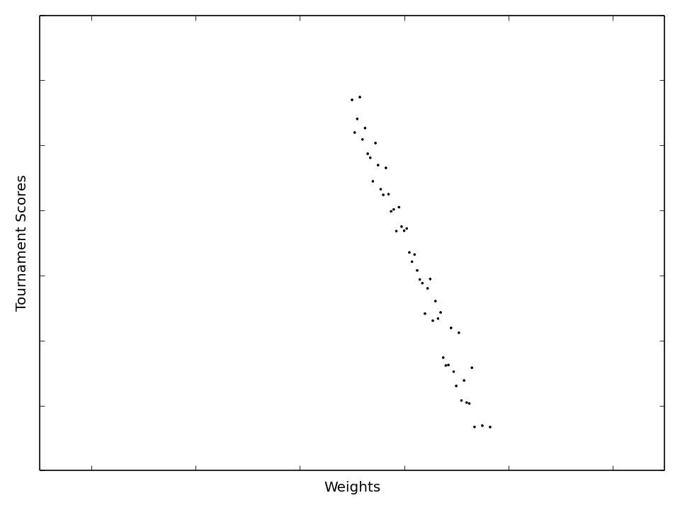

# Genetic Prisoner's Dilemma

_Genetic algorithm running for a basic Prisoner's Dilemma. This shows the initial population narrowing to their optimum._

## Why?

I was listening to [Dr. Robert Sapolsky's lecture on Human Behavioral Biology,](https://www.youtube.com/watch?v=NNnIGh9g6fA) where he discussed game theory and how certain game theory strategies were found in nature. 
It would be interesting to see if these strategies (e.g. [Tit-for-Tat](https://en.wikipedia.org/wiki/Tit_for_tat)) could be developed by a genetic algorithm.

## Genetic Twist

From [Dr. Robert Sapolsky's lecture above,](https://www.youtube.com/watch?v=NNnIGh9g6fA) he mentioned that Prisoner Dilemma Strategies for games iterated over time were found in nature. Further, Dr. Robert Axelrod and Dr. William D. Hamilton created the [Evolution of Cooperation](http://www-personal.umich.edu/~axe/research/Axelrod%20and%20Hamilton%20EC%201981.pdf) in 1981 which compared many different basic strategies together.

The most successful strategy from these trials was Tit-For-Tat. This strategy starts with cooperating, and then continues with copying the strategy of it's opponent in the previous round.  

The goal of this project will be to create a genetic algorithm to play iterated rounds of the Prisoners Dilemma. Perhaps the genetic algorithm ends up modelling a Tit-For-Tat strategy?  

## Implementation of Genetic Strategy 

#### Constant Decision strategy

_strategy does not look at the opponents moves_

The tricky thing with implementing a genetic strategy here is the lack of continuity of the output of the strategies; i.e., when each strategy makes a move, it is either cooperate or defect.

The implementation that I chose was to assign the genetic strategies a 'weight' between 0 and 1. When it was time to make a move, the strategy generates a random number between 0 and 1. If the number is less than the strategy's weight, the strategy cooperates. Else, it defects.

This gives a natural 'genetic' side of the genetic algorithm. By modifying the weight, the strategy tends towards defecting or cooperating (the results below shows that lower weights which tend to defect perform better than higher weights). 

